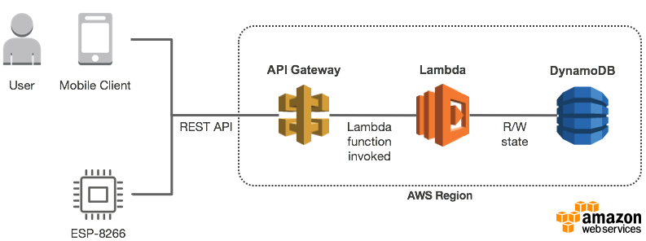

# ESP-8266 Simple Andon Signal Using AWS API Gateway Over Secure HTTPS

Andon is a lean manufacturing term referring to a visual signal to notify support teams of a quality or process problem. In this example, we use the ESP-8266 microcontroller to manage a 4-color LED tower. The device connects to your Wi-Fi network and contacts your rest API server over a secure HTTPS connection to retrieve a JSON object, which we decode to find out the active color. The web page required to authenticate users and raise alarms is not covered by this tutorial. 

Sample JSON from server:

```
{
  "code":200, 
  "message":"OK", 
  "data":{
    "created":"2017-11-11T13:12:46.873Z", 
    "updated":"2017-11-11T17:18:40.094Z", 
    "value":2
  }
}
```



We use digital outputs D5, D6, D7 and D8 to drive the 4 LEDs. Each output produces 3,3 volts and drives one of the four half-H drivers (LD293D). These drivers are able to switch higher power: from 4,5 V to 36 V and up to 600 mA. Our application also includes a power supply (24 VDC and 5 VDC) as well as a 24 V LED tower. A small voltage regulator (LD1117AV) provides a stable 3,3 V to the ESP-8266 from the 5 V of the power supply.

LED blinking is done using a timer callback. Function os_timer_setfn() is called to init the timer and set our callback function. Then function os_timer_arm() is called to define the time interval in milliseconds and if the timer repeats. The timer callback is very useful in our application because we can continue blinking the LED in background while we call the server in foreground. The callback function must remain short without using the serial monitor.


This circuit diagram shows the connection between the ESP-8266, quadruple half-H driver and LED tower:


⚠ **Warning! I do not recommend to connecting your computer through USB at same time as any 5V power source, to prevent potential damage on your computer's USB port.**

⚠ **Warning! Never use the ESP-8266 for machine safety or safeguarding. Our example is a simple signal light.**

```
/*
 * Copyright 2017 Richard Ng-Jobidon
 *
 * Licensed under the Apache License, Version 2.0 (the "License");
 * you may not use this file except in compliance with the License.
 * You may obtain a copy of the License at
 *
 *     http://www.apache.org/licenses/LICENSE-2.0
 *
 * Unless required by applicable law or agreed to in writing, software
 * distributed under the License is distributed on an "AS IS" BASIS,
 * WITHOUT WARRANTIES OR CONDITIONS OF ANY KIND, either express or implied.
 * See the License for the specific language governing permissions and
 * limitations under the License.
 */
 
#include <ESP8266WiFi.h>
#include <WiFiClientSecure.h>
#include <ArduinoJson.h>
#include "user_interface.h"

// Global constants
const int GREEN_LED_PIN = D5;
const int YELLOW_LED_PIN = D6;
const int RED_LED_PIN = D7;
const int BLUE_LED_PIN = D8;
const char* ssid = "your-wifi-name";
const char* password = "your-password";
const char* host = "api.example.com";
const int httpsPort = 443;
const char* url = "/v1/value";
const char* fingerprint = "65 39 e1 1c 10 db af a4 ae ec 8e 7e a3 d4 68 e7 dc 36 f5 70";

// Global variables
bool global_success = false;   // Result of last request to server
int global_value = 0;          // Value from server to control LED tower
os_timer_t global_timer;       // Timer for LED blinking
bool global_blink = false;     // LED blinking state (on/off)

// Connect device to Wi-Fi network
void connectWiFi() {

  // Init Wi-Fi
  Serial.println();
  Serial.print("connecting to ");
  Serial.println(ssid);
  WiFi.begin(ssid, password);

  // Wait for Wi-Fi connection
  while (WiFi.status() != WL_CONNECTED) {
    delay(700);
    Serial.print(".");

    // Blink yellow LED
    digitalWrite(YELLOW_LED_PIN, global_blink ? HIGH : LOW);    
    global_blink = !global_blink;
  }

  // Turn off yellow LED
  digitalWrite(YELLOW_LED_PIN, LOW);
  Serial.println("");
  Serial.println("WiFi connected");
  Serial.println("IP address: ");
  Serial.println(WiFi.localIP());
  
}

// Connect device to REST API server over secure HTTPS
void connectServer() {
  
  // Use WiFiClientSecure class to create TLS connection
  WiFiClientSecure client;
  Serial.print("connecting to ");
  Serial.println(host);

  // Connection status
  if (client.connect(host, httpsPort)) {
    // Success
    Serial.println("connected!");
  }
  else {
    // Failure
    Serial.println("connection failed");
    return;
  }

  // Verify TLS certificate fingerprint
  if (client.verify(fingerprint, host)) {
    Serial.println("certificate matches");
  } else {
    Serial.println("certificate doesn't match");
  }
  
  // Send HTTP GET request
  client.print("GET ");
  client.print(url);
  client.println(" HTTP/1.1");
  client.print("Host: ");
  client.println(host);
  client.println("Content-Type: application/json");
  client.println("Connection: close");
  client.println();

  // Pause to let answer the server 
  delay(500);
 
  // Read HTTP header from server
  String json = "";
  bool header = true;
  while(header && client.available()){
    String line = client.readStringUntil('\r');
    if (line == "HTTP/1.1 200 OK") global_success = true;
    if (line == "\n") header = false;
    Serial.print(line);
  }
  Serial.println();
  if (global_success) Serial.println("HTTP OK");
  else Serial.println("HTTP ERROR");

  // Read HTTP body from server
  while (global_success && !header && client.available()) {
    String line = client.readStringUntil('\r');
    Serial.print(line);
    json = json + line;
  }
  Serial.println();
  Serial.println("closing connection"); 

  // Reading JSON
  DynamicJsonBuffer jsonBuffer(200);
  JsonObject& root = jsonBuffer.parseObject(json);
  Serial.print("JsonObject: ");
  Serial.println((int)root["code"]);
  if (root.success()) {

    // Read REST API status code
    const int code = root["code"];
    const char* message = root["message"];
    Serial.print("code: ");
    Serial.println(code);
    Serial.print("message: ");
    Serial.println(message);

    // Read REST API value
    if (code == 200) {
      global_value = root["data"]["value"];  
      Serial.print("value: ");
      Serial.println(global_value);

      // Turn on/off LED colors
      digitalWrite(GREEN_LED_PIN, global_value == 1 ? HIGH : LOW);
      if (global_value != 2) digitalWrite(YELLOW_LED_PIN, LOW);
      if (global_value != 3) digitalWrite(RED_LED_PIN, LOW);
      if (global_value != 4) digitalWrite(BLUE_LED_PIN, LOW);
    }
  }  
}

// Timer callback for LED blinking
void timerCallback(void *pArg) {

  digitalWrite(YELLOW_LED_PIN, global_blink && (global_value == 2) ? HIGH : LOW);    
  digitalWrite(RED_LED_PIN, global_blink && (global_value == 3) ? HIGH : LOW);    
  digitalWrite(BLUE_LED_PIN, global_blink && (global_value == 4) ? HIGH : LOW);    
  global_blink = !global_blink;

} 

// Setup code to run once
void setup() {

  // Set pin ouput mode
  pinMode(GREEN_LED_PIN, OUTPUT);
  pinMode(YELLOW_LED_PIN, OUTPUT);
  pinMode(RED_LED_PIN, OUTPUT);
  pinMode(BLUE_LED_PIN, OUTPUT);

  // Turn off all LED
  digitalWrite(GREEN_LED_PIN, LOW);
  digitalWrite(YELLOW_LED_PIN, LOW);
  digitalWrite(RED_LED_PIN, LOW);
  digitalWrite(BLUE_LED_PIN, LOW);
  delay(1000);

  // Light show
  digitalWrite(GREEN_LED_PIN, HIGH);
  digitalWrite(YELLOW_LED_PIN, LOW);
  digitalWrite(RED_LED_PIN, LOW);
  digitalWrite(BLUE_LED_PIN, LOW);
  delay(250);
  digitalWrite(GREEN_LED_PIN, LOW);
  digitalWrite(YELLOW_LED_PIN, HIGH);
  digitalWrite(RED_LED_PIN, LOW);
  digitalWrite(BLUE_LED_PIN, LOW);
  delay(250);
  digitalWrite(GREEN_LED_PIN, LOW);
  digitalWrite(YELLOW_LED_PIN, LOW);
  digitalWrite(RED_LED_PIN, HIGH);
  digitalWrite(BLUE_LED_PIN, LOW);
  delay(250);
  digitalWrite(GREEN_LED_PIN, LOW);
  digitalWrite(YELLOW_LED_PIN, LOW);
  digitalWrite(RED_LED_PIN, LOW);
  digitalWrite(BLUE_LED_PIN, HIGH);
  delay(250);
  digitalWrite(GREEN_LED_PIN, LOW);
  digitalWrite(YELLOW_LED_PIN, LOW);
  digitalWrite(RED_LED_PIN, HIGH);
  digitalWrite(BLUE_LED_PIN, LOW);
  delay(250);
  digitalWrite(GREEN_LED_PIN, LOW);
  digitalWrite(YELLOW_LED_PIN, HIGH);
  digitalWrite(RED_LED_PIN, LOW);
  digitalWrite(BLUE_LED_PIN, LOW);
  delay(250);
  digitalWrite(GREEN_LED_PIN, HIGH);
  digitalWrite(YELLOW_LED_PIN, LOW);
  digitalWrite(RED_LED_PIN, LOW);
  digitalWrite(BLUE_LED_PIN, LOW);
  delay(250);
  digitalWrite(GREEN_LED_PIN, LOW);
  digitalWrite(YELLOW_LED_PIN, LOW);
  digitalWrite(RED_LED_PIN, LOW);
  digitalWrite(BLUE_LED_PIN, LOW);

  // Init serial monitor
  Serial.begin(115200);
  Serial.println();
  Serial.println("Andon v1.00");

  // Connect device to Wi-Fi 
  connectWiFi();

  // Setup timer
  os_timer_disarm(&global_timer); 
  os_timer_setfn(&global_timer, timerCallback, NULL);
  os_timer_arm(&global_timer, 700, true);

}

// Main code to run repeatedly
void loop() {

  // Connect device to server
  connectServer();

  // Wait 10 seconds
  delay(10000);
  
}
```
